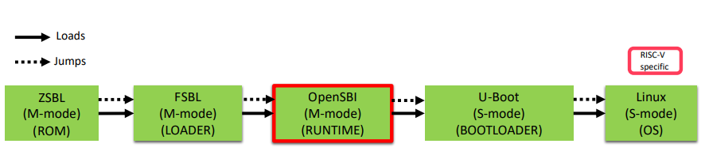
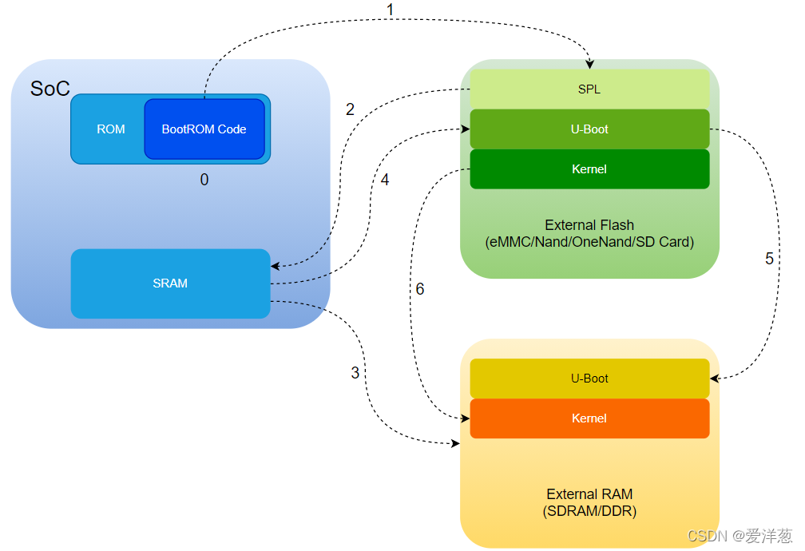

.. toctree::
   :maxdepth: 4
   :caption: Contents:

=================================================
读书笔记 《RISC-V 体系结构编程与实践》
=================================================

RISC-V体系结构基础知识
=======================

寄存器定义
------------

64位的RISC-V体系结构提供32个64位的整型通用寄存器，分别是x0~x31寄存器，而32位的RISC-V体系结构提供32个32位的整型通用寄存器。对于浮点数运算，64位的RISC-V体系结构也提供32个浮点数通用寄存器,分别是f0~f31寄存器。
RISC-V的通用寄存器通常具有别名和特殊用途，在书写汇编指令时可以直接使用别名。

- x0寄存器的别名为zero。寄存器的内容全是0，可以用作源寄存器，也可以用作目标寄存器。

- x1寄存器的别名为ra--链接寄存器，用于保存函数返回地址。注意到ra寄存器是caller saved的。Caller Saved寄存器在函数调用的时候不会保存，Caller Saved寄存器在函数调用的时候不会保存。
  这里的意思是，一个Caller Saved寄存器可能被其他函数重写。假设我们在函数a中调用函数b，任何被函数a使用的并且是Caller Saved寄存器，调用函数b可能重写这些寄存器。我认为一个比较好的
  例子就是Return address寄存器（注，保存的是函数返回的地址），你可以看到ra寄存器是Caller Saved，这一点很重要，它导致了当函数a调用函数b的时侯，b会重写Return address。所以基本上
  来说，任何一个Caller Saved寄存器，作为调用方的函数要小心可能的数据可能的变化；任何一个Callee Saved寄存器，作为被调用方的函数要小心寄存器的值不会相应的变化。

- x2寄存器的别名为sp-栈指针寄存器，指向栈的地址。

- x3寄存器的别名为gp--全局寄存器，用于链接器松弛优化。

- x4寄存器的别名为tp-线程寄存器，通常在操作系统中保存指向进程控制块-task_struct数据结构的指针。

- x5~x7以及x28~x31寄存器为临时寄存器，它们的别名分别是t0~t6。

- x8~x9以及x18~x27寄存器的别名分别是s0~s11。如果在函数调用过程中使用这些寄存器，需要保存到栈里。另外，S0寄存器可以用作栈指针(Frame Pointer，FP)。

- x10~x17寄存器的别名分别为a0~a7在函数调用时传递参数和返回值。

整型寄存器
^^^^^^^^^^^^^
+---------+----------+-----------------------------------+--------+
|Register | ABI Name | Description                       | Saver  |
+=========+==========+===================================+========+
|x0       |zero      | Hard-wired zero                   |        |
+---------+----------+-----------------------------------+--------+
|x1       |ra        | Return address                    | Caller |
+---------+----------+-----------------------------------+--------+
|x2       |sp        | Stack pointer                     | Callee |
+---------+----------+-----------------------------------+--------+
|x3       |gp        | Global pointer                    |        |
+---------+----------+-----------------------------------+--------+
|x4       |tp        | Thread pointer                    |        |
+---------+----------+-----------------------------------+--------+
|x5       |t0        | Temporary/alternate link register | Caller |
+---------+----------+-----------------------------------+--------+
|x6       |t1        | Temporaries                       | Caller |
+---------+----------+-----------------------------------+--------+
|x7       |t2        | Temporaries                       | Caller |
+---------+----------+-----------------------------------+--------+
|x8       |s0/fp     | Saved register/frame pointer      | Callee |
+---------+----------+-----------------------------------+--------+
|x9       |s1        | Saved register                    | Callee |
+---------+----------+-----------------------------------+--------+
|x10      |a0        | Function arguments/return values  | Caller |
+---------+----------+-----------------------------------+--------+
|x11      |a1        | Function arguments/return values  | Caller |
+---------+----------+-----------------------------------+--------+
|x12      |a2        | Function arguments                | Caller |
+---------+----------+-----------------------------------+--------+
|x13      |a3        | Function arguments                | Caller |
+---------+----------+-----------------------------------+--------+
|x14      |a4        | Function arguments                | Caller |
+---------+----------+-----------------------------------+--------+
|x15      |a5        | Function arguments                | Caller |
+---------+----------+-----------------------------------+--------+
|x16      |a6        | Function arguments                | Caller |
+---------+----------+-----------------------------------+--------+
|x17      |a7        | Function arguments                | Caller |
+---------+----------+-----------------------------------+--------+
|x18      |s2        | Saved registers                   | Callee |
+---------+----------+-----------------------------------+--------+
|x19      |s3        | Saved registers                   | Callee |
+---------+----------+-----------------------------------+--------+
|x20      |s4        | Saved registers                   | Callee |
+---------+----------+-----------------------------------+--------+
|x21      |s5        | Saved registers                   | Callee |
+---------+----------+-----------------------------------+--------+
|x22      |s6        | Saved registers                   | Callee |
+---------+----------+-----------------------------------+--------+
|x23      |s7        | Saved registers                   | Callee |
+---------+----------+-----------------------------------+--------+
|x24      |s8        | Saved registers                   | Callee |
+---------+----------+-----------------------------------+--------+
|x25      |s9        | Saved registers                   | Callee |
+---------+----------+-----------------------------------+--------+
|x26      |s10       | Saved registers                   | Callee |
+---------+----------+-----------------------------------+--------+
|x27      |s11       | Saved registers                   | Callee |
+---------+----------+-----------------------------------+--------+
|x28      |t3        | Temporaries                       | Caller |
+---------+----------+-----------------------------------+--------+
|x29      |t4        | Temporaries                       | Caller |
+---------+----------+-----------------------------------+--------+
|x30      |t5        | Temporaries                       | Caller |
+---------+----------+-----------------------------------+--------+
|x31      |t6        | Temporaries                       | Caller |
+---------+----------+-----------------------------------+--------+

浮点寄存器
^^^^^^^^^^^^^

+---------+----------+-----------------------------------+--------+
|Register | ABI Name | Description                       | Saver  |
+=========+==========+===================================+========+
|f0       | ft0      | FP temporaries                    | Caller |
+---------+----------+-----------------------------------+--------+
|f1       | ft1      | FP temporaries                    | Caller |
+---------+----------+-----------------------------------+--------+
|f2       | ft2      | FP temporaries                    | Caller |
+---------+----------+-----------------------------------+--------+
|f3       | ft3      | FP temporaries                    | Caller |
+---------+----------+-----------------------------------+--------+
|f4       | ft4      | FP temporaries                    | Caller |
+---------+----------+-----------------------------------+--------+
|f5       | ft5      | FP temporaries                    | Caller |
+---------+----------+-----------------------------------+--------+
|f6       | ft6      | FP temporaries                    | Caller |
+---------+----------+-----------------------------------+--------+
|f7       | ft7      | FP temporaries                    | Caller |
+---------+----------+-----------------------------------+--------+
|f8       | fs0      | FP saved registers                | Callee |
+---------+----------+-----------------------------------+--------+
|f9       | fs1      | FP saved registers                | Callee |
+---------+----------+-----------------------------------+--------+
|f10      | fa0      | FP arguments/return values        | Caller |
+---------+----------+-----------------------------------+--------+
|f11      | fa1      | FP arguments/return values        | Caller |
+---------+----------+-----------------------------------+--------+
|f12      | fa2      | FP arguments                      | Caller |
+---------+----------+-----------------------------------+--------+
|f13      | fa3      | FP arguments                      | Caller |
+---------+----------+-----------------------------------+--------+
|f14      | fa4      | FP arguments                      | Caller |
+---------+----------+-----------------------------------+--------+
|f15      | fa5      | FP arguments                      | Caller |
+---------+----------+-----------------------------------+--------+
|f16      | fa6      | FP arguments                      | Caller |
+---------+----------+-----------------------------------+--------+
|f17      | fa7      | FP arguments                      | Caller |
+---------+----------+-----------------------------------+--------+
|f18      | fs2      | FP saved registers                | Callee |
+---------+----------+-----------------------------------+--------+
|f19      | fs3      | FP saved registers                | Callee |
+---------+----------+-----------------------------------+--------+
|f20      | fs4      | FP saved registers                | Callee |
+---------+----------+-----------------------------------+--------+
|f21      | fs5      | FP saved registers                | Callee |
+---------+----------+-----------------------------------+--------+
|f22      | fs6      | FP saved registers                | Callee |
+---------+----------+-----------------------------------+--------+
|f23      | fs7      | FP saved registers                | Callee |
+---------+----------+-----------------------------------+--------+
|f24      | fs8      | FP saved registers                | Callee |
+---------+----------+-----------------------------------+--------+
|f25      | fs9      | FP saved registers                | Callee |
+---------+----------+-----------------------------------+--------+
|f26      | fs10     | FP saved registers                | Callee |
+---------+----------+-----------------------------------+--------+
|f27      | fs11     | FP saved registers                | Callee |
+---------+----------+-----------------------------------+--------+
|f28      | ft8      | FP temporaries                    | Caller |
+---------+----------+-----------------------------------+--------+
|f29      | ft9      | FP temporaries                    | Caller |
+---------+----------+-----------------------------------+--------+
|f30      | ft10     | FP temporaries                    | Caller |
+---------+----------+-----------------------------------+--------+
|f31      | ft11     | FP temporaries                    | Caller |
+---------+----------+-----------------------------------+--------+

关于Caller与Callee
^^^^^^^^^^^^^^^^^^^^^^

加载与存储指令
^^^^^^^^^^^^^^^^^
lb rd, offset(rs1)
以rs1寄存器的值为基地址,在偏移offset的地址处加载一字节数据，经过符号拓展之后写入目标寄存器rd中

基础指令集
^^^^^^^^^^^^^^

+------------+-----------------------------------------------------------+
| 扩展指令集 |                           说明                            |
+============+===========================================================+
| F          | 单精度浮点数扩展指令集                                    |
+------------+-----------------------------------------------------------+
| D          | 双精度浮点数扩展指令集                                    |
+------------+-----------------------------------------------------------+
| Q          | 4倍精度浮点数扩展指令集                                   |
+------------+-----------------------------------------------------------+
| M          | 整型乘法和除法扩展指令集                                  |
+------------+-----------------------------------------------------------+
| C          | 压缩指令集                                                |
+------------+-----------------------------------------------------------+
| A          | 原子操作指令集                                            |
+------------+-----------------------------------------------------------+
| B          | 位操作指令集                                              |
+------------+-----------------------------------------------------------+
| E          | 为嵌入式设计的整型指令集                                  |
+------------+-----------------------------------------------------------+
| H          | 虚拟化扩展指令集                                          |
+------------+-----------------------------------------------------------+
| K          | 密码运算扩展指令集                                        |
+------------+-----------------------------------------------------------+
| V          | 可伸缩矢量扩展指令集                                      |
+------------+-----------------------------------------------------------+
| P          | 打包 SIMD（packed-SIMD）扩展指令集                        |
+------------+-----------------------------------------------------------+
| J          | 动态翻译语言（dynamically translated language）扩展指令集 |
+------------+-----------------------------------------------------------+

+---------------------+--------------+-------------------------------------------------------------------------------------------------+
|      加载指令       | 数据位宽／位 |                                              说明                                               |
+=====================+==============+=================================================================================================+
| lb rd, offset(rs1)  | 8            | 以rs1寄存器的值为基地址，在偏移offset的地址处加载一字节数据，经过符号扩展之后写入目标寄存器rd中 |
+---------------------+--------------+-------------------------------------------------------------------------------------------------+
| lbu rd, offset(rs1) | 8            | 以rs1寄存器的值为基地址，在偏移offset的地址处加载一字节数据，经过零扩展之后写入目标寄存器rd中   |
+---------------------+--------------+-------------------------------------------------------------------------------------------------+
| 1h rd, offset(rs1)  | 16           | 以rs1寄存器的值为基地址，在偏移offset的地址处加载两字节数据，经过符号扩展之后写入目标寄存器rd中 |
+---------------------+--------------+-------------------------------------------------------------------------------------------------+
| 1hu rd, offset(rs1) | 16           | 以rs1寄存器的值为基地址，在偏移offset的地址处加载两字节数据，经过零扩展之后写入目标寄存器rd中   |
+---------------------+--------------+-------------------------------------------------------------------------------------------------+
| lw rd, offset(rs1)  | 32           | 以rs1寄存器的值为基地址，在偏移offset的地址处加载4字节数据，经过符号扩展之后写入目标寄存器rd中  |
+---------------------+--------------+-------------------------------------------------------------------------------------------------+
| 1wu rd, offset(rs1) | 32           | 以rs1寄存器的值为基地址，在偏移offset的地址处加载4字节数据，经过零扩展之后写入目标寄存器rd中    |
+---------------------+--------------+-------------------------------------------------------------------------------------------------+
| 1d rd, offset(rs1)  | 64           | 以rs1寄存器的值为基地址，在偏移 offset的地址处加载8字节数据，写入寄存器rd中                     |
+---------------------+--------------+-------------------------------------------------------------------------------------------------+
| lui rd, imm         | 64           | 先把imm（立即数）左移12位，然后进行符号扩展，把结果写入rd寄存器中                               |
+---------------------+--------------+-------------------------------------------------------------------------------------------------+

+---------------------+--------------+--------------------------------------------------------------------------+
|      存储指令       | 数据位宽／位 |                                   说明                                   |
+=====================+==============+==========================================================================+
| sb rs2, offset(rs1) | 8            | 把rs2寄存器的低8位宽的值存储到以rs1寄存器的值为基地址加上offset的地址处  |
+---------------------+--------------+--------------------------------------------------------------------------+
| sh rs2, offset(rs1) | 16           | 把rs2寄存器的低16位宽的值存储到以rs1寄存器的值为基地址加上offset的地址处 |
+---------------------+--------------+--------------------------------------------------------------------------+
| sw rs2, offset(rs1) | 32           | 把rs2寄存器的低32位宽的值存储到以rs1寄存器的值为基地址加上offset的地址处 |
+---------------------+--------------+--------------------------------------------------------------------------+
| sd rs2, offset(rs1) | 64           | 把rs2寄存器的值存储到以rs1寄存器的值为基地址加上offset的地址处           |
+---------------------+--------------+--------------------------------------------------------------------------+

+-------------+-------------+---------------------------------------------------------------------+
|  其他指令   | 数据位宽/位 |                                说明                                 |
+=============+=============+=====================================================================+
| lui rd, imm | 64          | 先把立即数imm左移12位，然后进行符号拓展到64位，结果写入到rd寄存器中 |
+-------------+-------------+---------------------------------------------------------------------+

+--------------------------+--------------------------------------------------------------------+-----------------------------------------------+
| 与PC相关的加载和存储伪指令           | 指令组合                                                               | 说明                                            |
+==========================+====================================================================+===============================================+
| la rd, symbol(not PIC)   | auipc rd, delta[31:12] + delta[11]; addi rd, rd, delta[11:0]       | 加载符号的绝对地址。其中 delta= symbol-pc                 |
+--------------------------+--------------------------------------------------------------------+-----------------------------------------------+
| la rd, symbol(PIC)       | auips rd, delta[31:12] + delta[11]; l{w|d} rd, rd, delta[11:0]     | 加载符号的绝对地址。其中 delta =GOT[symbol]-pc            |
+--------------------------+--------------------------------------------------------------------+-----------------------------------------------+
| 11a rd, synbol           | auipc rd,delta[31:12] + delta[11]; addi rd, rd, delta[11:0]        | 加载符号的本地地址(local address)。其中 delta= syrmbol-pc |
+--------------------------+--------------------------------------------------------------------+-----------------------------------------------+
| 1{blhiwld} rd, symnbo1   | auipc rd, delta[31:12] + delta[11]; l{b|hlwld} rd, delta[11:0](rd) | 加载符号的内容                                       |
+--------------------------+--------------------------------------------------------------------+-----------------------------------------------+
| s{b1hlwld} rd, symbol,rt | auipc rt, delta[31:12] + delta[11]; s{blh|wld} rd, delta[11:0](xt) | 存储内容到符号中。其中t为临时寄存器                            |
+--------------------------+--------------------------------------------------------------------+-----------------------------------------------+
| 1i rd, imm               | 根据情况扩展为多条指令                                                        | 加载立即数(imm)到d寄存器中                              |
+--------------------------+--------------------------------------------------------------------+-----------------------------------------------+

+----------+-----------------------+------------------------------------------------------------------------------------------------------------------------------------+
| 移位指令 | 指令格式 | 说明 |
+==========+=======================+====================================================================================================================================+
| sll      | sll rd, rs1, rs2      | 逻辑左移指令。 把rs1寄存器左移rs2位,结果写入rd寄存器中                                                                             |
+----------+-----------------------+------------------------------------------------------------------------------------------------------------------------------------+
| slli     | slli rd, rs1, shamt   | 立即数逻辑左移指令。把rs1寄存器左移shamt位,结果写入rd寄存器中                                                                      |
+----------+-----------------------+------------------------------------------------------------------------------------------------------------------------------------+
| slliw    | slliw rd, rs1, shamt  | 立即数逻辑左移指令。截取s1寄存器的低32位作为新的源操作数,然后左移shamt位,根据结果进行符号扩展后写入rd寄存器                        |
+----------+-----------------------+------------------------------------------------------------------------------------------------------------------------------------+
| sllw     | sllw rd, rs1, rs2     | 逻辑左移指令。截取rs1寄存器的低32位作为新的源操作数,然后左移rs2位(取rs2寄存器低5位的值),根据结果进行符号扩展后写入rd寄存器         |
+----------+-----------------------+------------------------------------------------------------------------------------------------------------------------------------+
| sra      | sra rd, rs1, rs2      | 算术右移指令。 把rs1寄存器右移rs2位,根据rs1寄存器的旧值,进行符号扩展后写入rd寄存器中                                               |
+----------+-----------------------+------------------------------------------------------------------------------------------------------------------------------------+
| srai     | srai rd, rs1, shamt   | 立即数算术右移指令。 把rs1寄存器右移shamt位,进行符号扩展后写入rd寄存器中                                                           |
+----------+-----------------------+------------------------------------------------------------------------------------------------------------------------------------+
| sraiw    | sraiw rd, rs1, shamt  | 立即数算术右移指令。 截取rs1寄存器的低32位作为新的源操作数,然后右移shamat位,根据新的源操作数进行符号扩展后写入rd寄存器中           |
+----------+-----------------------+------------------------------------------------------------------------------------------------------------------------------------+
| sraw     | sraw rd, rs1, rs2     | 算术右移指令。 截取rs1寄存器的低32位作为新的源操作数,然后右移s2位(取rs2寄存器低5位的值),根据新的源操作数进行符号扩展后写入rd寄存器 |
+----------+-----------------------+------------------------------------------------------------------------------------------------------------------------------------+
| srl      | srlrd, rs1,rs2        | 逻辑右移指令。 把rs1寄存器右移rs2位,进行零扩展后写入rd寄存器中                                                                     |
+----------+-----------------------+------------------------------------------------------------------------------------------------------------------------------------+
| srli     | srli rd, rs1, shamt   | 立即数逻辑右移指令。 把rs1寄存器右移shamt位,进行零扩展后写入rd寄存器中                                                             |
+----------+-----------------------+------------------------------------------------------------------------------------------------------------------------------------+
| srliw    | srliw, rs1,rs2,shamat | 立即数逻辑右移指令，截取rs1寄存器的低32位作为新的源操作数，然后有意shamt位，进行符号扩展后写入rd寄存器                             |
+----------+-----------------------+------------------------------------------------------------------------------------------------------------------------------------+
| srlw     | srlw rd, rs1, rs2     | 逻辑右移指令。 截取rs1寄存器的低32位作为新的源操作数，然后右移rs2位(取rs2寄存器低5位的值)，进行符号扩展后写入rd寄存器中            |
+----------+-----------------------+------------------------------------------------------------------------------------------------------------------------------------+

知识点补充：动态链接与位置无关代码
^^^^^^^^^^^^^^^^^^^^^^^^^^^^^^^^^^^^^^

在代码编写到运行过程中，符号地址的确定可以在编译链接时确定，这种技术对应静态链接，而大部分静态语言之所以叫做静态也是因为变量地址在编译时就已经确定了。

当然符号地址也可以在装载（load）时确定，动态链接就用到了这种技术。

当然还可以完全在运行的时候确定符号或变量的位置，动态语言比如Python之类就是在运行的时候动态查找变量，这是动态语言的一大核心（貌似扯远了）。

静态链接
^^^^^^^^^^^^^

在多个目标文件链接成一个可执行文件时，可执行文件完全持有每一个文件的代码和数据，即相当于保留了每一个目标文件的副本，这样在链接时可以对每个目标文件中
的符号进行重定位，使之合并成一个可执行文件。 并且所有的文件必须共同链接，不然就无法确定某一个符号或者代码的地址。

但是静态链接存在一个很大的问题，就是空间的浪费。由于可执行文件保留每一个目标文件的副本，这使得很多程序包含很多公用的代码，比如几乎每个IO程序可能都包
含了printf，scanf之类的常用代码，这使得代码冗余，空间浪费。

静态链接还存在一个很严重的问题，一个小的目标文件如果有修改，需要重新链接整个项目，这样效率是缓慢的。

当然这样也有好处，每一个可执行文件都持有副本，就可以对自己的副本进行任意操作不用担心影响其他程序，比如重定位。

动态链接
^^^^^^^^^^^^^^

而动态链接技术消除了空间浪费问题（其实也有一点，你想数据段无论如何也是不能共享的吧，除非是只读的）和对于链接的目标文件的静态依赖，通过把重定位转移到了
装载和运行时。有得必有失，这样动态链接必然比静态链接装载执行慢一些。

由于动态链接的通过动态共享一份目标代码，解决了空间浪费和重新链接问题。不同进程之间的共享可以通过地址映射解决。我们现在有两个选择：

为每个动态链接库规定一个固定的地址，这样减小了动态链接库编译的难度，因为在编译期链接库就知道自己需要装载的地址，跟普通的编译没有什么区别。但是这样我们
必须为每一个链接库保留地址空间，即使可能我们没有用到它，进一步链接库的更新对于这个保留地址管理都是一个挑战，而且保留地址完全移除了虚拟地址做出的努力。
使得动态链接库的代码可以在任意位置执行，显然采取这种方式更加灵活，且动态链接库中必然不能有绝对地址，与之相伴的技术PIC（position independence code）
可以用来解决这个问题。

PIC
^^^^^^^^^^^

要做到位置无关代码，必然要求每一个链接这个动态共享库的可执行程序对于同一个符号的引用可以是不同的。而由于是共享的，每个动态链接库代码段的内容是完全一样的，
这样只能在数据段做手脚了，这样对应了上文中我们提到的不同程序的对于链接库的数据段是不共享的。

位置无关代码在数据段开始为每一个全局符号保留了一个条目（GOT global offset table），每一个条目中保存了全局符号的绝对地址（这个绝对地址，在动态链接库装载的
时候被填写），每次对动态链接中全局符号的引用，首先找到GOT中的条目，然后获得全局符号的地址，这样就实现了位置无关代码。

现在我们从头梳理一下和动态链接库中链接时的所有流程和已知条件：

发现任何引用动态链接库中的符号 - 在链接时动态链接器可以发现
修改符号引用代码（具体如上），使得其代码无关。（每个引用全局符号的模块都有其GOT，GOT的绝对位置在链接时便可以确定，相当于静态链接。）
主程序与动态链接库装入内存，开始执行。
（这里缺少了一部分动态链接程序对于外部符号的引用，与主程序引用动态链接符号同理，不再赘述。）

PIC补充
^^^^^^^^^^^^^

如上一节，你可以看到，对于每一个符号引用需要多一次寻址过程（GOT中表查找）和几条代码的运算，可以说降低了一点性能。其实PIC对于全局变量和全局函数的处理稍有不同。

全局函数还使用了PLT（procedure linkage table）和延迟绑定（lazy binding）技术，减少了一定的额外代码数量，通过将函数定制的绑定推迟到第一次函数执行的时候。（个人感觉没什么意思，有兴趣的请自行查阅。）

总结
^^^^^^^^^
为了解决单个文件过大和编译困难的问题，我们发明了多文件之间编译链接技术，从而使一个文件的变化不用整个项目进行编译。更进一步通过动态链接技术，一个文件的变化，整个项目的重新链接也不需要了。

==============================
RIVAI固件开发笔记
==============================

BuildRoot入门
=================
buildroot是Linux平台上一个构建嵌入式Linux系统的框架。整个Buildroot是由Makefile脚本和Kconfig配置文件构成的。你可以和编译Linux内核一样，通过buildroot配置，menuconfig修改，编译出一个完整的可以直接烧写到机器上运行的Linux系统软件(包含boot、kernel、rootfs以及rootfs中的各种库和应用程序)。
使用buildroot搭建基于qemu的虚拟开发平台，参考《通过buildroot+qemu搭建ARM-Linux虚拟开发环境》。

RISC-V 启动流程
-----------------------

如下图所示，RISC-V 引导流程分为多个阶段，我们重点关注 OpenSBI 与 U-Boot。

U-Boot SPL
-------------------

1、SPL名字由来
^^^^^^^^^^^^^^^^^^^^^^
SPL全称叫做：Secondary Program Loader，看名字，像是一个什么二级加载相关的；实质上，也是二级加载；

众所周知，u-boot是用来boot我们的嵌入式系统的，那直接使用u-boot就行了呗，为何还会多出一个uboot spl呢？那我们从系统启动开始说起吧；

站在芯片厂商的角度来说，硬件系统一上电，一定是要去某个地址取指令（一般是 0x00000000），然后软件便开始很欢快的运行起来了；通常来讲，SoC厂家都会做一个ROM在SoC内部，这个ROM很小(成本，你懂的)，
里面固化了上电启动的代码（一经固化，永不能改，是芯片做的时候，做进去的）；这部分代码呢，我们管它叫做 BootROM；

换句话来说，上电后，先接管系统的是 SoC 厂家的 BootROM，他要做些什么事情呢？初始化系统，CPU 的配置，关闭看门狗，初始化时钟，初始化一些外设（比如 USB Controller、MMC Controller，Nand Controller 等）；
我们管这个 BootROM 叫做一级启动程序，而排在后面的就叫二级启动，这就是 SPL 名字的由来；

2、SPL 拿来干嘛
^^^^^^^^^^^^^^^^^^^

2.1、铺垫
""""""""""""
为了讲清楚 spl 的用处，我需要先铺垫一点其他东西；

如果是大芯片（不是单片机），外挂了存储设备（eMMC、Nand、SDCard 等）和内存 RAM（SDRAM、DDR 等），通常情况下呢，我们要让系统跑起来，需要先烧写代码，这个烧写代码，其实是将可执行的二进制文件写到外部的
存储设备上（eMMC、Nand、SD Card 等）；系统上电启动的时候呢，去把他们读到内存中去执行；前面我们说了，上电后，其实SoC 厂家自己的 BootROM，其他可执行的程序（u-boot、Kernel）都放（烧写）到了外部存储器
是先去执行上；

那么BootROM的代码除了去初始化硬件环境以外，还需要去外部存储器上面，将接下来可执行的程序读到内存来执行；
既然是读到内存执行，那么这个内存可以不可以是我们板载的DDR呢？理论上是可以的，但是，SoC 厂家设计的 DDR 控制器呢，一般会支持很多种类型的 DDR 设备，并且会提供兼容性列表，SoC 厂家怎么可能知道用户 PCB
上到底用了哪种内存呢？所以，直接把外部可执行程序读到 DDR 显然是不太友好的，一般来说呢，SoC 都会做一个内部的小容量的 SRAM （又是成本），BootROM 将外部的可执行程序从存储器中读出来，放到 SRAM 去执行;

好了，现在我们引出了 SRAM，引出了 BootROM；

那么 BootROM 从具体哪个存储器读出二进制文件呢？SoC 厂家一般会支持多种启动方式，比如从 eMMC 读取，从 SDCard 读取，从 Nand Flash 读取等等；上电的时候，需要告诉它，它需要从什么样的外设来读取后面的启
动二进制文件；

一般的设计思路是，做一组 Bootstrap Pin，上电的时候呢？BootROM 去采集这几个 IO 的电平，来确认要从什么样的外部存储器来加载后续的可执行文件；比如呢，2 个 IO，2'b00 表示从 Nand 启动，2'b01 表示从eMMC
启动，2'b10 表示从 SDCard 启动等等；

当 BootROM 读到这些值后，就会去初始化对应的外设，然后来读取后面要执行的代码；这些 IO 一般来说，会做成板载的拨码开关，用于调整芯片的启动方式；

这里，多说一句，读取烧写的二进制的时候呢，需要注意一些细节，比如，SoC 厂家告诉你，你需要先把 SDCard 初始化称为某种文件系统，然后把东西放进去才有效，之类的；因为文件系统是组织文件的方式，并不是裸分区；
你按照 A 文件系统的方式放进去，然后 SoC 的 BootROM 也按照 A 文件系统的方式读出来，才能够达成一致；

2.2、spl
""""""""""""

好了，铺垫得够多的了，这里我们回归主题：spl；

前面说了，BootROM 会根据 Bootstrap Pin 去确定从某个存储器来读可执行的二进制文件到 SRAM 并执行；理论上来说，这个二进制文件就可以是我们的 u-boot.bin 文件了；也就是 BootROM 直接加载 u-boot.bin；

理论上是这样的，但是这里有一个问题，就是 SRAM 很贵，一般来说，SoC 的片上 SRAM 都不会太大，一般 4KB、8KB、16KB...256KB不等；但是呢，u-boot 编译出来，却很大，好几百KB，放不下！

放不下怎么办？有两种办法：

放不下就放不下呗，BootROM 加载多少算多少；
做一个小一点的 boot 程序，先让 BootROM 加载这个小的程序，后面再由这个小 boot 去加载 u-boot；

比如，我们的 u-boot 有 300KB，SRAM 有 8KB，外部 DDR 1GB：

如果使用第一种方案的话，u-boot 的前面 8K 被加载进入 SRAM 执行，u-boot 被截断，我们就需要保证在 u-boot 的前 8KB 代码，把板载的 DDR 初始化好，把整个 u-boot 拷贝到 DDR，然后跳转到 DDR 执行；

第二种方案的话，我们做一个小的 u-boot ，这个 u-boot 就叫做 spl，它很小很小（小于SRAM大小），它先被 BootROM 加载到 SRAM 运行，那么这个 spl 要做什么事情呢？最主要的就是要初始化 DDR Controller，
然后将真正的大 u-boot 从外部存储器读取到 DDR 中，然后跳转到大 u-boot；

如下图所示：

我标记了一些东西：

先假设，我们的“货”，都已经放置到了外部存储器上，也就是绿色部分；

0、上电后，BootROM 开始执行，初始化时钟，关闭看门狗，关 Cache，关中断等等，根据 Bootstrap Pin 来确定启动设备，初始化外设；

1、使用外设驱动，从存储器读取 SPL；

---------------- 以上部分是 SoC 厂家的事情，下面是用户要做的事情 ----------------

2、SPL 被读到 SRAM 执行，此刻，控制权以及移交到我们的 SPL 了；

3、SPL 初始化外部 DDR；

4、SPL 使用驱动从外部存储器读取 u-boot 并放到 DDR；

5、跳转到 DDR 中的 u-boot 执行；

6、加载内核；

实际情况中，还需注意很多问题：

1、编译阶段的链接地址，是否需要地址无关？

2、SPL 的代码和 u-boot 的代码是否有重合的地方？如果有，是否意味着 SPL 执行过的，跳转到 u-boot 又要在执行一次？

3、具体情况下，需要配置哪些硬件？怎么配置？

=============================================
链接脚本
=============================================

01 基本概念
================

.. include:: markdown\01 基本概念\README.md
   :parser: myst_parser.sphinx_

02 格式
================

.. include:: markdown\02 格式\README.md
   :parser: myst_parser.sphinx_

03 简要示例
================

.. include:: markdown\03 简要示例\README.md
   :parser: myst_parser.sphinx_

04 简要链接指令
================

.. include:: markdown\04 简要链接指令\README.md
   :parser: myst_parser.sphinx_

05 符号值分配
================

.. include:: markdown\05 符号值分配\README.md
   :parser: myst_parser.sphinx_

06 SECTIONS指令
================

.. include:: markdown\06 SECTIONS指令\README.md
   :parser: myst_parser.sphinx_

07 MEMORY指令
================

.. include:: markdown\07 MEMORY指令\README.md
   :parser: myst_parser.sphinx_

08 PHDRS指令
================

.. include:: markdown\08 PHDRS指令\README.md
   :parser: myst_parser.sphinx_

09 VERSION指令
=====================

.. include:: markdown\09 VERSION指令\README.md
   :parser: myst_parser.sphinx_

10 Linker Scripts中的表达式
============================

.. include:: markdown\10 Linker Scripts中的表达式\README.md
   :parser: myst_parser.sphinx_

11 构建可运行程序
====================

.. include:: markdown\11 构建可运行程序\README.md
   :parser: myst_parser.sphinx_

12 抛弃glibc依赖
======================

.. include:: markdown\12 抛弃glibc依赖\README.md
   :parser: myst_parser.sphinx_